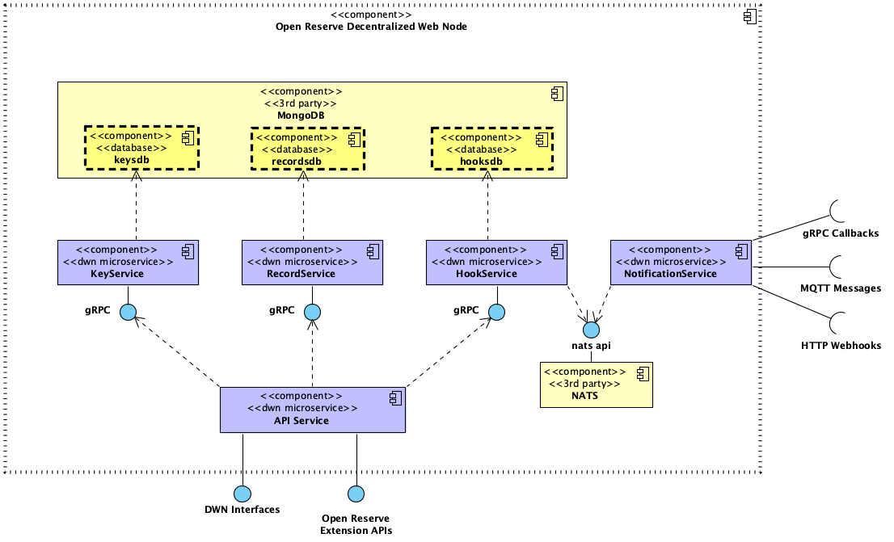

# Operations Documentation

## Open Reserve DWN Node Components

[](./dwn_node_components.png)

| Component Name | Description |
|----------------|-------------|
| API Service | Exposes an HTTP API for all of the DWN Interfaces (ie RecordsWrite, HooksQuery, etc) |
| KeyService | Manages node keys, abstracts away HSMs or other secure key management interfaces |
| RecordService |  Manages Record lifecycles |
| HookService | Managed Hook lifecycles, finds hooks and raises notifications |
| NotificationService | Delivers raised notifications through a number of channels (http webhooks, gRPC callbacks, MQTT messages, more TBD) |
| MongoDB | Document-based Database Service to store records, hooks, and other node data and configuration |
| NATS | Asynchronous inter-component messaging system to decouple long-running tasks from service operations (such as webhook notifications and other processing) |

## Docker Compose

To run locally for testing, or deployment elsewhere using Docker & Docker Compose, you may:

```sh

git clone https://github.com/openreserveio/dwn.git
cd dwn/deployment/localdev/compose
docker compose -f ./full-deploy.yaml build && docker compose -f ./full-deploy.yaml up

```

## Docker Images

We periodically push new docker images to the Github container registry.  To pull them, just do this:

```sh

# API Service
docker pull ghcr.io/openreserveio/api:latest

# Key Service
docker pull ghcr.io/openreserveio/keysvc:latest

# Record Service
docker pull ghcr.io/openreserveio/recordsvc:latest

# Hook Service
docker pull ghcr.io/openreserveio/hooksvc:latest

# Notification Service
docker pull ghcr.io/openreserveio/notificationsvc:latest

```


